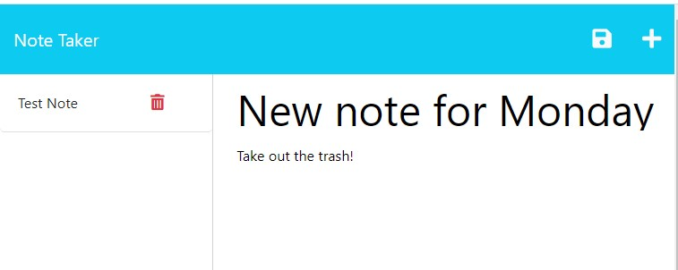

# Note_Taker

## Description
The Note Taker application allows users the ability to write and save notes. This application uses an Express.js back end and saves and retrieves note data from a JSON file.

## Purpose
The Note Taker application has a clear and easy-to-use interface that allows users to stay organized by allowing note taking. The easy ability to see saved notes on the left hand side gived the option to delete a note when completed or no longer needed as well as the option to create and save new entries. 

## Table of Contents

- [Installation](#installation)
- [Usage](#usage)
- [Contributing](#contributing)
- [License](#license)

## Installation
To install my project use the following link: https://github.com/dianavw8/Note_Taker and follow these simple directions:

Above the list of files, click on the "Code" button.

Copy the URL for the repository.

Open Git Bash.

Change the current working directory to the location where you want the cloned directory.

Type git clone, and then paste the URL you copied earlier.

Press Enter to create your local clone.

For more help and information achiving this, check out the following website: https://docs.github.com/en/repositories/creating-and-managing-repositories/cloning-a-repository

## Usage
The refactored website can be found at: https://limitless-plateau-99753.herokuapp.com/notes

The following image demonstrates the web application's appearance and functionality:

## License

MIT License link: https://github.com/babel/babel/blob/master/LICENSE

## Contributing

The following are contributers to the making of my Professional README Generator:

https://shields.io/

https://choosealicense.com/

https://coding-boot-camp.github.io/full-stack/github/professional-readme-guide

https://opensource.org/licenses## License

